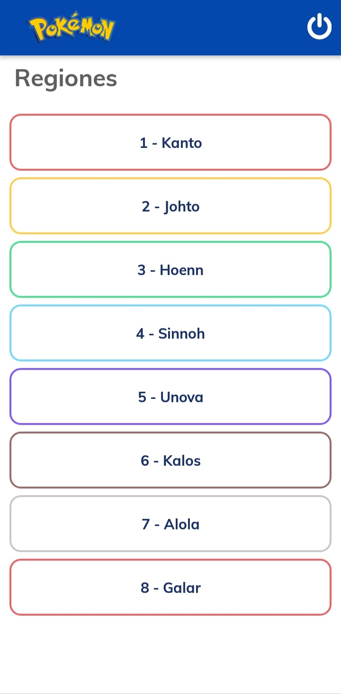
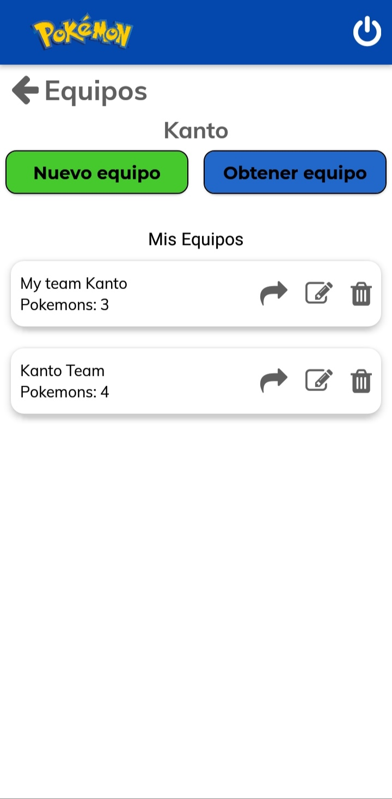
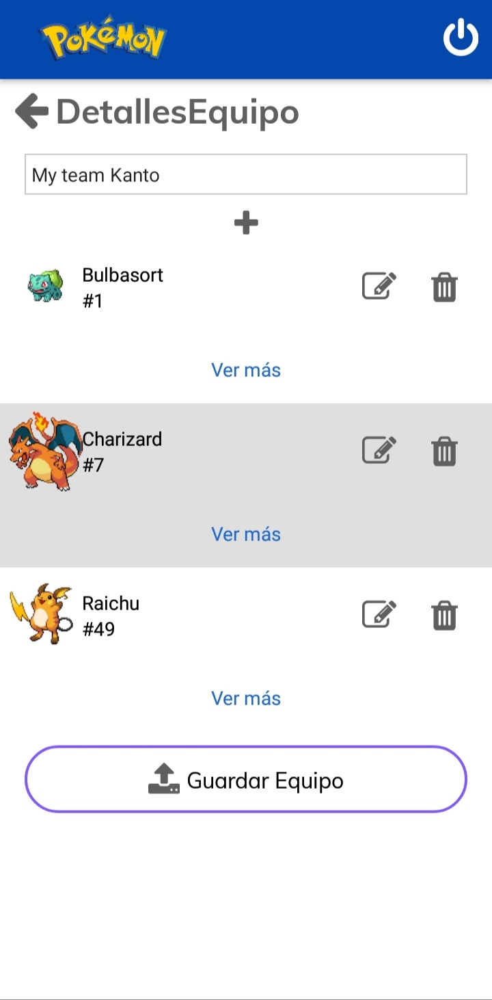
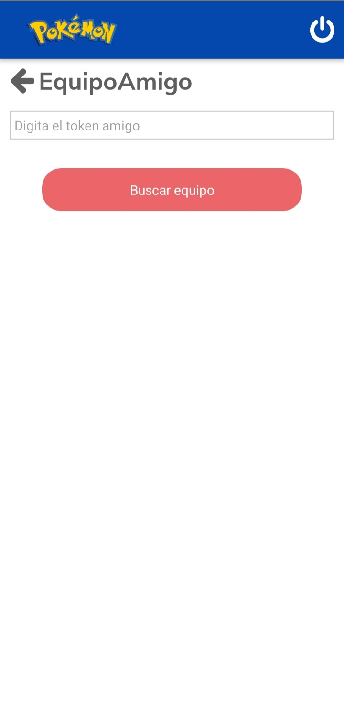
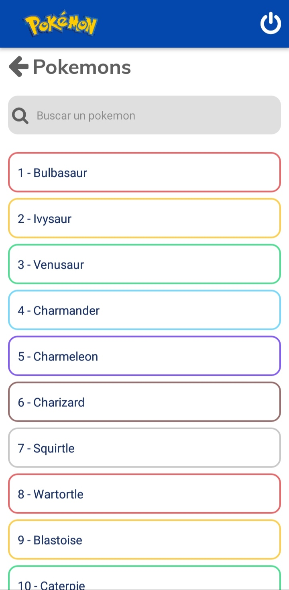
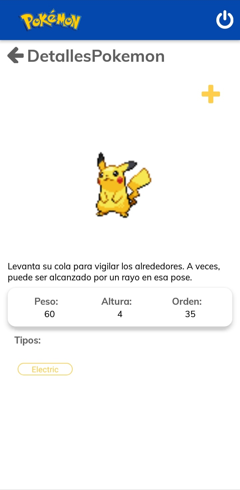

# PokemonX App

## Comandos

### Run android

```cmd
npm run android
# or
yarn android
```
### Clean build

```cmd
npm run clean
# or
yarn clean
```

### Release APK

```cmd
npm run release
# or
yarn release
```

### Build APK

```cmd
npm run build:apk
# or
yarn build:apk
```

## Funcionalidades implementadas

* Redux.
* Alias path.
* Custom fonts.
* Cacheo de imágenes.
* Realtime Database.
* Firebase Crashlytics.
* Firebase Auth para autenticación de usuarios con gmail.
* Uso de la [api de pokemón](https://pokeapi.co/).

## Screens

### Iniciales
Login	                   |  Regiones             
:-------------------------:|:-------------------------:
 | 

### Equipos
Equipos            		   |  Detalle del equipo	   |  Token de equipo amigo             
:-------------------------:|:-------------------------:|:-------------------------:
  |   | 

### Pokemons
Listado de pokemons      |  Detalle del pokemon
:-------------------------:|:-------------------------:
  |  

